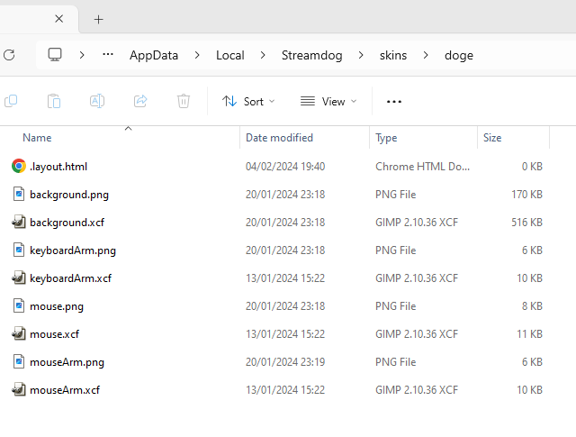
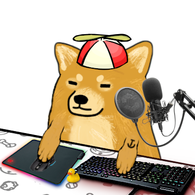
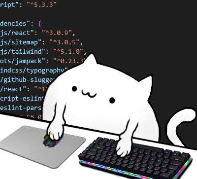
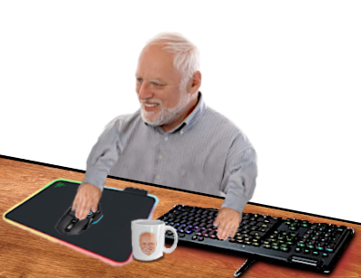
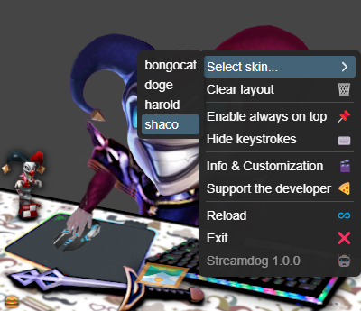
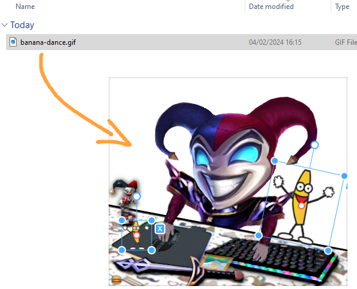

# [Streamdog | Your loyal avatar companion](https://gpiskas.com/projects/streamdog/)

[Streamdog](https://gpiskas.com/projects/streamdog/) is an avatar app that will imitate your clicks and keystrokes in real time, bringing some life to your stream or recording. It is an ideal companion for those who don’t want to use a camera.
You can easily customize it or create new skins. All you need is an image editor and some creativity.

## Download & License
[Download from Github Releases](https://github.com/gpiskas/streamdog/releases) \
Free for personal use \
Copyright Georgios Piskas © 2024 \
[Terms of Use](https://gpiskas.com/terms/)

## Features & Demo
- Imitates your clicks and keystrokes in real time
- Transparent background to blend with your scene
- Trivial to integrate in recording tools like OBS
- Switch between built-in skins or create your own
- Very easily customizable using any image editor
- Option to hide keystrokes and keep always on top
- Free for personal use
- [Your support is greatly appreciated](https://gpiskas.com/about/)

<video controls src=".github/streamdog.mp4" title="Streamdog demo"></video>

## Skins & Customization
To create new skins or edit existing ones, open the context menu (`right click or burger icon`) and select `Info & Customization`.
This will open up the `skins` folder, where you can edit existing `.png` files or create new ones.
Skin changes or new skins will appear immediately on the screen or the dropdown.

A skins consists of these four self-explanatory parts. The skin name is the name of the folder.
- `background.png`
- `mouse.png`
- `mouseArm.png`
- `keyboardArm.png`

This is how a skin looks like. The `.xcf` files can be edited with [GIMP](https://www.gimp.org/).

Here are a few of the predefined skins and the context menu.

## Drag & Drop Layout
You can drag & drop images and animated GIFs directly in Streamdog and adjust their position, rotation and scale.
The layout tools and the window border will automatically disappear when Streamdog is not in focus.
The layout is saved automatically and restored on relaunch, separately for each skin. \
`Pro Tip:` you can copy a layout to another skin simply by copying `.layout.html` to its folder.

## More info
[Please visit the official Streamdog page for more information.](https://gpiskas.com/projects/streamdog/)